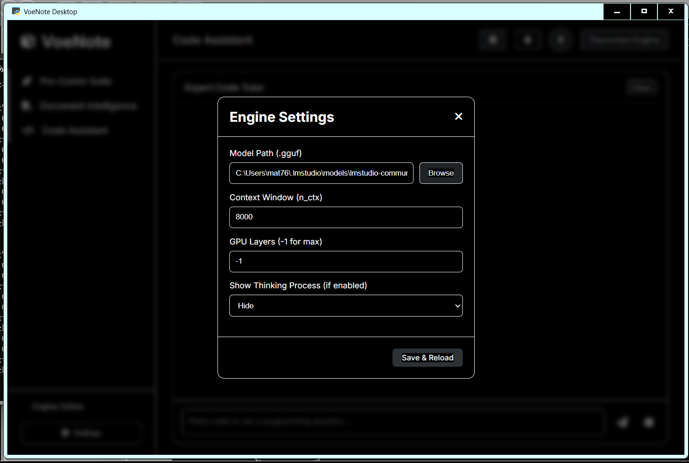
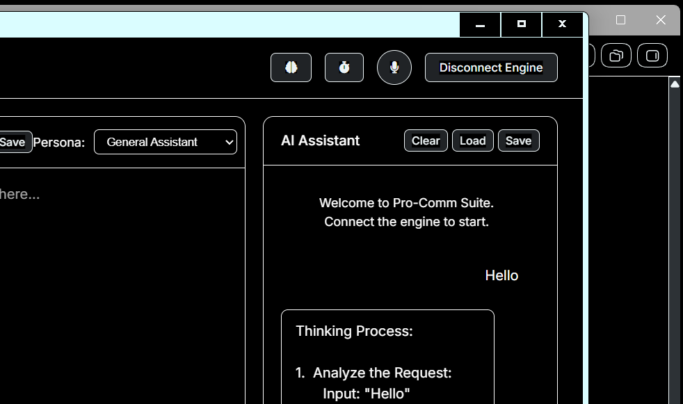
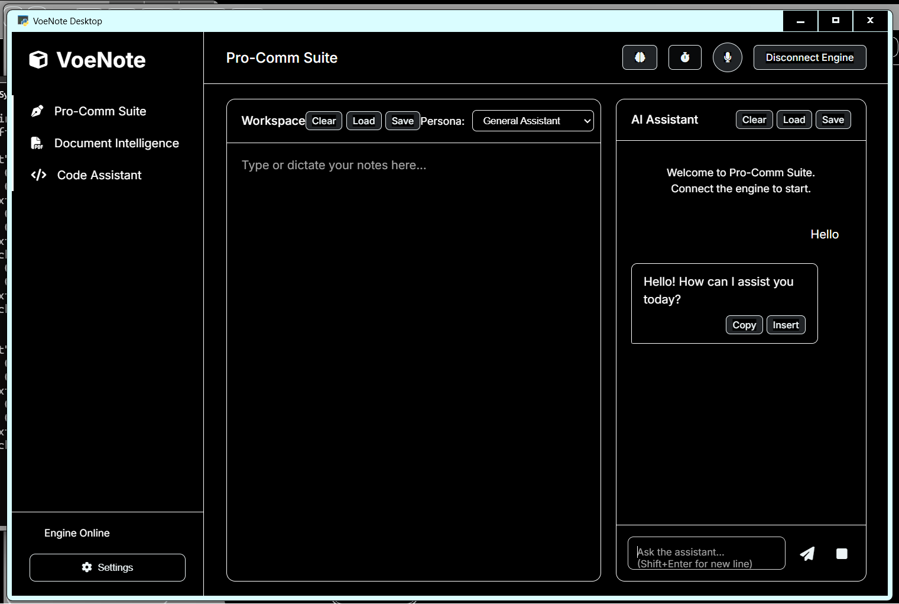
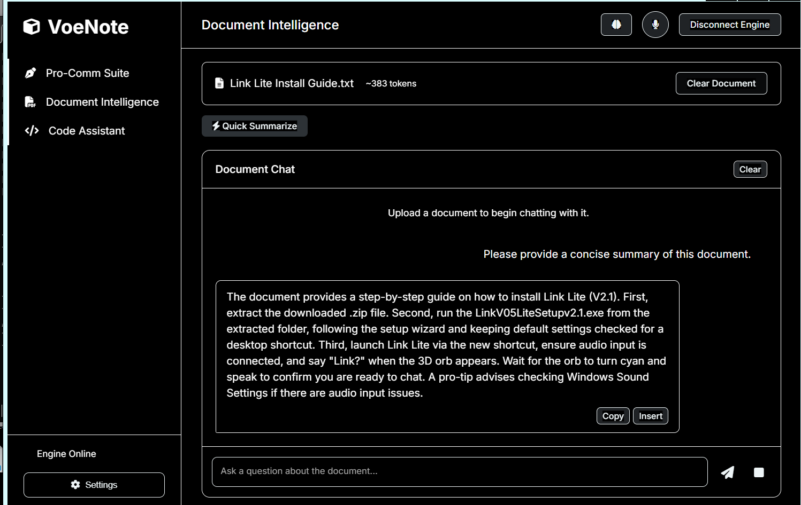
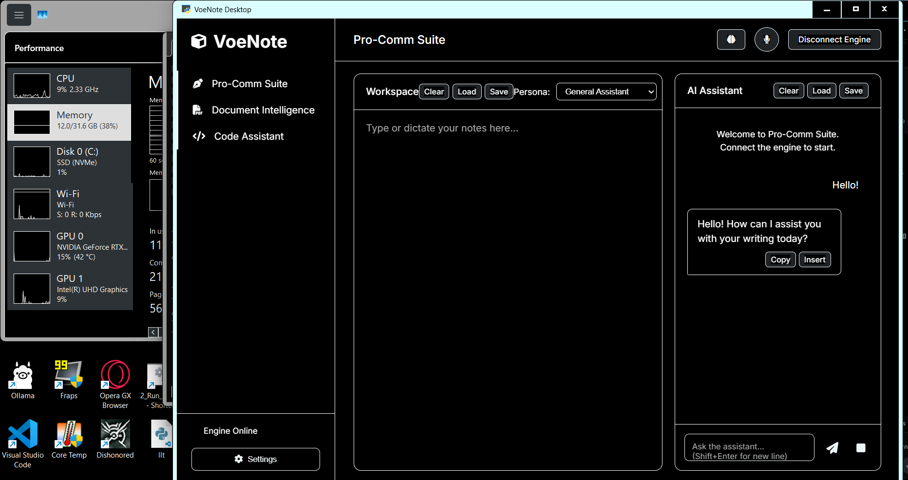
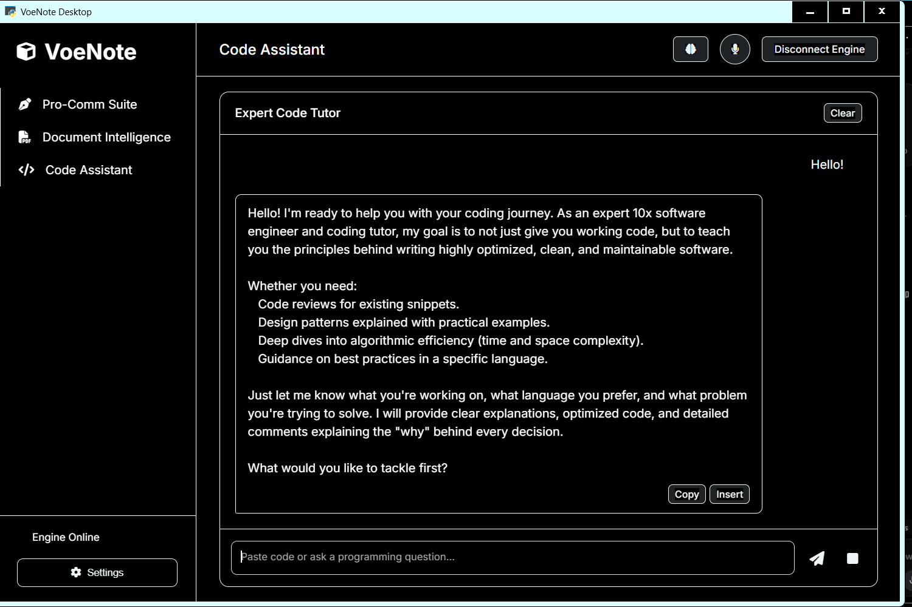
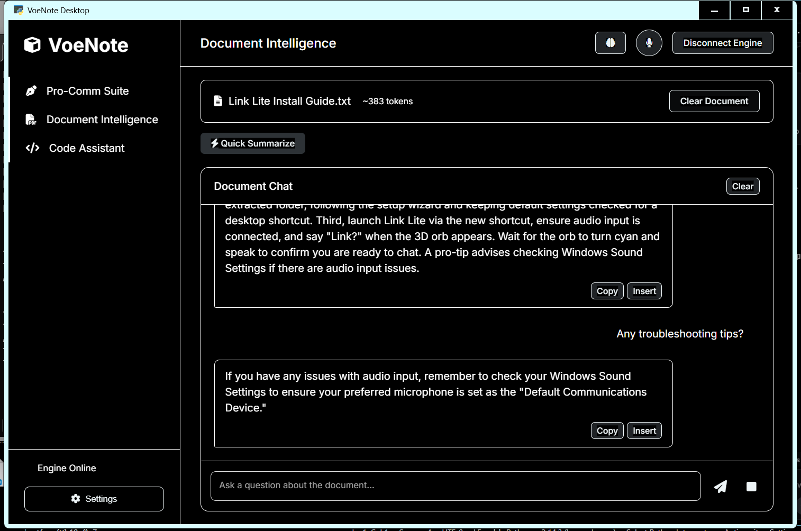
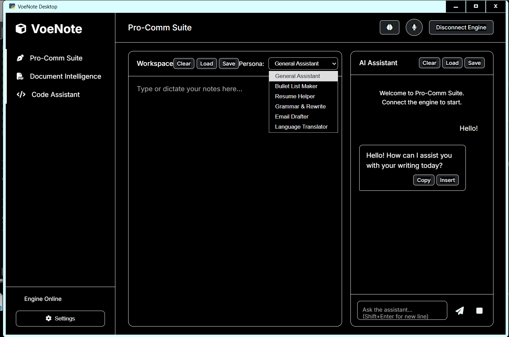
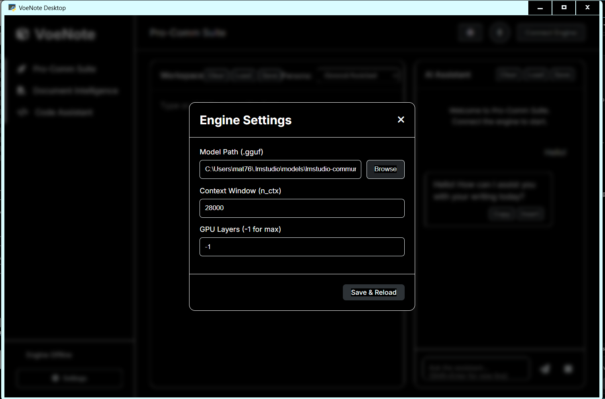

# VoeNote v1.0

A local AI intelligence worksuite. 

VoeNote Desktop is a local-first, privacy-focused AI productivity suite. It allows you to run powerful Large Language Models (LLMs) directly on your machine without data ever leaving your system. Designed for professionals, it integrates advanced document analysis, intelligent code assistance, and a structured "Pro-Comm" workspace for drafting and refinement.

Key Features

100% Offline: No cloud dependencies. Your notes, documents, and code remain private on your machine.

Pro-Comm Workspace: A distraction-free notepad with built-in AI personas (Resume Helper, Grammar/Rewrite, Bullet List Maker, Translator, and more).

Document Intelligence: Chat with your local TXT files using RAG (Retrieval-Augmented Generation) technology.

Expert Code Tutor: Specialized context for programming tasks and code debugging.

Voice Input: Built-in speech-to-text integration for hands-free drafting.

Shared Context: Toggleable state allows the AI to reference your work across different suites seamlessly.
  Example. Working on your resume? 
    Upload it in 'Document Intelligence'. Then go to the 'Pro-Comm Suite', make certain your 'Persona:' is set to 'Resume Helper' and send the 'AI Assistant' a message to request for whatever you need help with! 

Cross-Platform: Built with Python and pywebview, providing a native feel.

Technology Stack

Engine: llama.cpp (via llama-cpp-python) for high-performance GGUF inference.

UI Framework: pywebview with a clean, glass-morphism aesthetic.

Transcription: faster-whisper for efficient, local audio processing.

Quick Start

Clone the repository:

git clone https://github.com/DionNedeh/VoeNote.git

cd VoeNote

Install dependencies:

pip install -r requirements.txt

Run the application:

python main.py

Usage Notes

Model Compatibility: VoeNote supports any .gguf model. For the best balance of speed and intelligence, we recommend using gemma-4-E4B-it.
Settings: Upon launch, head to the Settings modal to link your downloaded GGUF model and configure your GPU layers for hardware acceleration.

Privacy Policy
VoeNote Desktop processes all data locally. We do not collect telemetry, chat logs, or user data. Your privacy is guaranteed by design.

Screenshots

